# Provider Data Validation & Directory Management Agent  
### Challenge VI: IT/BPM – Firstsource  
### Agentic AI System Architecture & End-to-End Design  

---

## 1. Business Problem

Healthcare payers face major accuracy issues in provider directories:  

- **40–80%** inaccuracies in addresses, phone numbers, and specialties.  
- Manual verification requires staff to call hundreds of providers monthly.  
- Provider information is inconsistent across systems (claims, directory, web, PDFs).  
- Regulatory bodies require frequent directory data updates (every 30 days).  
- Licensing validation and credential checks delay provider onboarding.  
- Member dissatisfaction increases when providers listed are unreachable or incorrect.  

This creates **high operational cost**, **compliance risk**, and **poor member experience**.

---

## 2. Hackathon Objective

Build a **fully automated Provider Validation & Directory Management System** that:

- Extracts data from PDFs, spreadsheets, and web sources.  
- Validates provider identity, contact info, license, and specialties.  
- Scrapes and enriches provider data using external public sources.  
- Assigns confidence scores with explainability.  
- Produces updated directory entries with minimal human involvement.  
- Processes **200 provider profiles < 30 minutes**.  

---

## 3. Solution Overview

We design an **Agentic AI System** composed of four coordinated agents orchestrated by a Reasoning Engine:

1. **Data Validation Agent** – Verifies provider identity, license, NPI & address.  
2. **Information Enrichment Agent** – Gathers additional details, specialties, certifications.  
3. **Quality Assurance Agent** – Ensures consistency across multiple data sources.  
4. **Directory Management Agent** – Generates cleaned directory entries, reports, and alerts.

The architecture supports **scalability**, **traceability**, **audit logs**, and **rapid human review**.

---

# 4. Agent Roles & Responsibilities

## 4.1 Data Validation Agent
- Scrapes practice websites for phone/address confirmation.  
- Performs NPI registry lookups (public API).  
- Validates state medical license details.  
- Uses Maps/Places APIs for phone/address verification.  
- Generates a **Validation Confidence Score**.

## 4.2 Information Enrichment Agent
- Extracts specialties, education, affiliations, and certifications.  
- Analyzes provider websites & hospital directories.  
- Detects geographic or specialty gaps.  
- Builds an enriched provider profile.

## 4.3 Quality Assurance Agent
- Compares records across all sources.  
- Detects anomalies, mismatches, and fraud signals.  
- Generates data quality metrics.  
- Prioritizes profiles needing manual review.

## 4.4 Directory Management Agent
- Produces standardized directory entries.  
- Generates alerts if a provider’s data is outdated or suspicious.  
- Produces summary/exception reports for operations teams.  
- Supports workflow management for human-in-the-loop review.

---

## 5. Architectural Design
flowchart TD

    O[Orchestrator Engine\nPlan · Coordinate · Validate]

    IN[Input Layer\nCSV · PDFs · API Feeds] --> O

    BUS[(Event Bus and Shared Memory)]
    O --> BUS

    subgraph A1[Data Validation Agent]
        V1[Website Scraper]
        V2[NPI Registry Validator]
        V3[State License Checker]
        V4[Phone and Address Verifier]
        V5[Confidence Scoring Engine]
        V1 --> V5
        V2 --> V5
        V3 --> V5
        V4 --> V5
    end
    O --> A1
    A1 --> BUS

    subgraph A2[Information Enrichment Agent]
        E1[Specialty Extraction]
        E2[Education and Certification Lookup]
        E3[Hospital Directory Parsing]
        E4[Coverage Gap Analyzer]
        E5[Profile Builder]
        E1 --> E5
        E2 --> E5
        E3 --> E5
        E4 --> E5
    end
    O --> A2
    A2 --> BUS

    subgraph A3[Quality Assurance Agent]
        QA1[Cross Source Consistency]
        QA2[Anomaly Detection]
        QA3[Data Quality Metrics]
        QA4[Risk and Priority Scoring]
        QA1 --> QA4
        QA2 --> QA4
        QA3 --> QA4
    end
    O --> A3
    A3 --> BUS

    subgraph A4[Directory Management Agent]
        D1[Clean Directory Generator]
        D2[Alerts and Notifications]
        D3[Summary Reports]
        D4[Human Review Queue]
        D1 --> D3
        D2 --> D3
        D3 --> D4
    end
    O --> A4
    A4 --> BUS

    subgraph UI[User Interface Layer]
        U1[Agent Logs and Traces]
        U2[Dashboard Panel Streamlit]  %% <-- fixed here
        U3[Provider Reports]
        U4[Provider Email Templates]
    end

    O --> UI
```

# 6. End-to-End Data Validation Pipeline (Improved & More Realistic)

```mermaid
flowchart LR
    A[Input: Provider CSV + PDFs] --> B[Ingestion Layer]

    B --> C{PDF Type?}
    C -- Digital --> D1[pdfplumber Extraction]
    C -- Scanned --> D2[OCR via Tesseract]

    D1 --> E[Normalize + Parse Provider Data]
    D2 --> E

    %% VALIDATION
    E --> F1[NPI Registry Validation]
    E --> F2[Website Scraping]
    E --> F3[Address/Phone Verification]
    E --> F4[License Lookup]

    F1 --> G[Cross-Validation Engine]
    F2 --> G
    F3 --> G
    F4 --> G

    %% ENRICHMENT
    G --> H1[Specialty/Education Enrichment]
    H1 --> H2[Identify Conflicts or Missing Info]

    %% QA
    H2 --> I1[Confidence Score Generation]
    I1 --> I2[Risk Classification]
    I2 --> I3[Manual Review Queue]

    %% DIRECTORY GENERATION
    I3 --> J1[Cleaned Directory Entry Builder]
    J1 --> J2[Summary + Exception Reports]
    J2 --> J3[Provider Notification Templates]

    J3 --> Z[Output: Updated Directory + Dashboard]
```




# 7. External Data Sources

| Data Source                         | Usage                                   |
|------------------------------------|-------------------------------------------|
| **NPI Registry API**               | Identity, credentials, addresses          |
| **State Medical Boards**           | License status verification               |
| **Hospital & Health System Sites** | Additional specialties & affiliations     |
| **Google Maps / Places API**       | Address, phone number validation          |
| **Medicare Physician Compare**     | Specialty inference & utilization         |
| **Synthetic Data Generator**       | Benchmarking, anomaly testing             |

---

# 8. Output Deliverables

### **System produces:**

- Clean, standardized provider directory entries  
- Confidence scores for each data element (0–1)  
- Exceptions list requiring manual review  
- Automated provider update emails  
- Dashboard with aggregated metrics  

### **Performance Goal:**  
**200 providers processed in under 30 minutes**  
with **70–90% reduction in manual effort**.

---

# 9. Key System Capabilities

- OCR + text extraction  
- Multi-source web scraping  
- NPI & license validation  
- Fuzzy matching + entity resolution  
- Anomaly detection  
- Data enrichment & standardization  
- Dashboard and workflow management  
- Explainable decision logs  

---

# 10. Conclusion

This Agentic AI Architecture provides a scalable, modular, and production-ready blueprint for solving the high-impact challenge of maintaining accurate healthcare provider directories.  
It reduces compliance risk, operational workload, and member dissatisfaction while enabling rapid data validation and enrichment.

---

